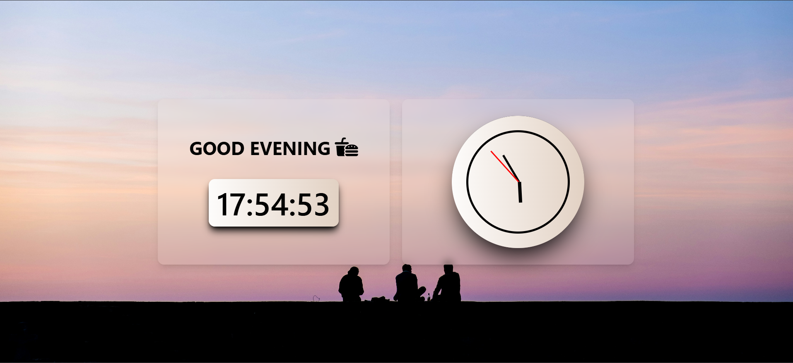

# 🕰️ Digital & Analog Clock with Glassmorphism

A modern and visually appealing clock interface that blends both **digital** and **analog** formats, styled with a soft **glassmorphism effect** and a custom background.

Built using **HTML**, **CSS**, and **JavaScript**, this project focuses on simplicity, interactivity, and clean UI design.

---

## 📸 Preview

> *(Ensure the `preview.png` image is placed inside the `Images` folder in your project directory.)*

---

## 🛠️ Technologies Used

- **HTML** – structure of the clock  
- **CSS** – custom styling with glassmorphism (blur, transparency, and depth)  
- **JavaScript** – live functionality for both analog and digital time display

---

## 📬 Contact

- 📧 **Email**: [rudrakshisharma86@gmail.com](mailto:rudrakshisharma86@gmail.com)  
- 💼 **LinkedIn**: [Rudrakshi Sharma](https://www.linkedin.com/in/rudrakshi-sharma/)  
- 🐙 **GitHub**: [itsrudra143](https://github.com/itsrudra143)
